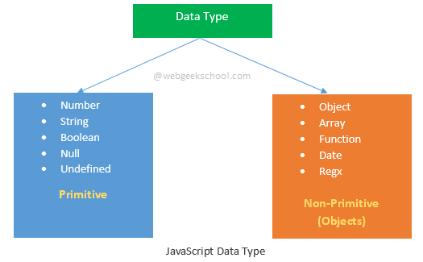

> The set of types in the JavaScript language consists of **`primitive values`** and **`objects`**.



## types
- Primitive values (immutable datum represented directly at the lowest level of the language)
    - [Boolean type](https://developer.mozilla.org/en-US/docs/Web/JavaScript/Data_structures#boolean_type)
    - [Null type](https://developer.mozilla.org/en-US/docs/Web/JavaScript/Data_structures#null_type)
    - [Undefined type](https://developer.mozilla.org/en-US/docs/Web/JavaScript/Data_structures#undefined_type)
    - [Number type](https://developer.mozilla.org/en-US/docs/Web/JavaScript/Data_structures#number_type)
    - [BigInt type](https://developer.mozilla.org/en-US/docs/Web/JavaScript/Data_structures#bigint_type)
    - [String type](https://developer.mozilla.org/en-US/docs/Web/JavaScript/Data_structures#string_type)
    - [Symbol type](https://developer.mozilla.org/en-US/docs/Web/JavaScript/Data_structures#symbol_type)

> **A `primitive value` is a value that has no properties or methods,  a `primitive data` type is data that has a primitive value.**

- [Objects](https://developer.mozilla.org/en-US/docs/Web/JavaScript/Data_structures#objects) (collections of properties)


**JavaScript defines 5 types of primitive data types:**
- `string`
- `number`
- `boolean`
- `null`
- `undefined`

### undefined
A variable that has not been assigned a value is of type undefined.

### null
Means the variable has no value or no data type.

### string
Example:
```js
const str = 'hello world'
```

### number
JavaScript has only one type of number. Numbers can be written with or without decimals.

Unlike many other programming languages, JavaScript does not define different types of numbers, like integers, short, long, floating-point etc.

JavaScript numbers are always stored as double precision floating point numbers, following the international IEEE 754 standard.

### Objects
All Objects in JavaScript are **non-primitive data type**, they are just a reference data type. Such as Array, Function, etc. Map & Object, they are a collection of properties.

### symbol
Represents a unique identifier.

